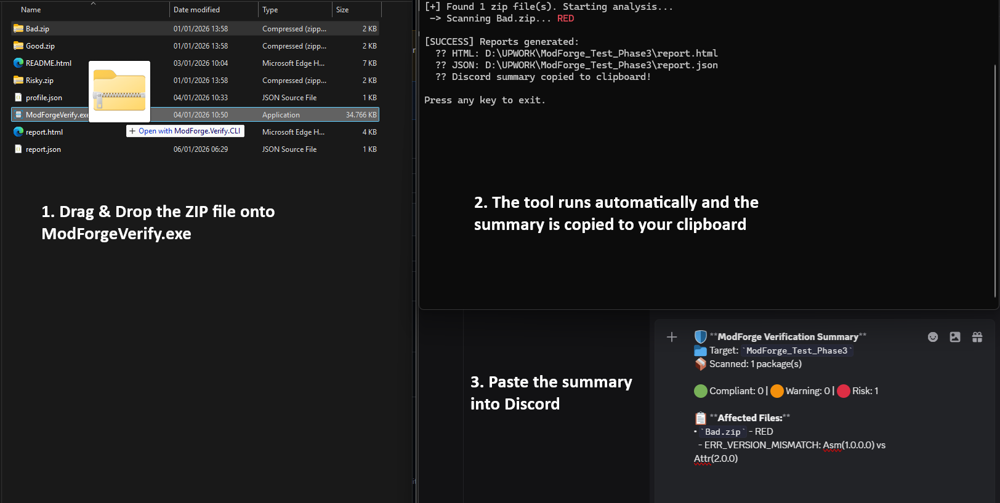

# ModForge Verify CLI (v0.1.0)

## What this is
ModForge Verify is a deterministic, static compliance checker for BepInEx/Unity mod packages.

It answers one question: Does this package comply with the selected Profile’s rules?

Compliance ≠ safety. A GREEN result does not guarantee runtime stability, absence of bugs, multiplayer sync, or security.

## Quickstart (Support Flow)
1. **Drag & Drop** the mod ZIP (or folder) onto `ModForgeVerify.exe`.
2. **Tool runs headlessly**: The scan completes and the summary is automatically copied to your clipboard.
3. **Paste into Discord**: Share the summary with helpers immediately to get structured support.

## Mental model (10 seconds)
- **Engine** = Judge (stable, deterministic)
- **Profiles** = Law (versioned, community-defined)
- **Report** = Social Ticket (used in support workflows)

## How this fits into support
This tool is designed to reduce support back-and-forth by making the first response more structured:
- Users run the check on a mod ZIP (or a folder of zips).
- The tool outputs a short Discord-ready summary (copied to clipboard) + full report artifacts.
- Helpers can ask: “Paste your ModForge report first so we can help.”

## “Blank Slate” profile.json (important)
The profile.json shipped with v0.1.0 is intentionally a Blank Slate example:
- It demonstrates the format and lets communities define their own allow/block lists and severities.
- It is not claiming to be “the official rules” for any specific game/community.
- Users can populate allowlists/blocklists to match their local rules.

## Verdict wording
- **GREEN = COMPLIANT (static)** — no deterministic violations detected.
- **AMBER = REVIEW (not failure)** — uncertainties detected; manual review may be needed.
- **RED = NON-COMPLIANT** — deterministic violations detected.

---
*Compliance only. Does not guarantee runtime stability.*
